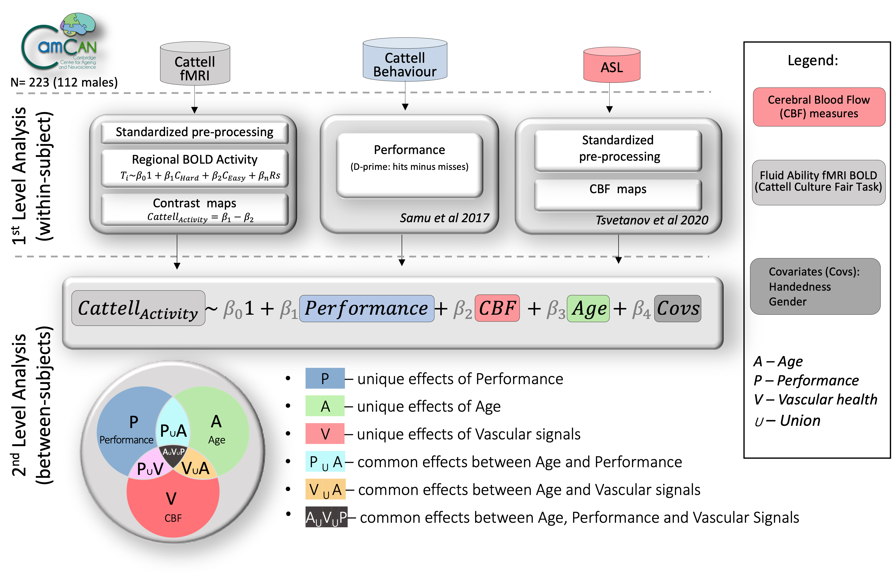

## Commonality Analysis for Neuroimaging

Commonality analysis for neuroimaging. Code supporting Wu et al, "Cerebral blood flow predicts multiple demand network activity and fluid intelligence across the lifespan".

### Background
This voxel-wise GLM-like approach uses MATLAB's fitlm to save nii image of coefficients and p-values for each variable and residuals. This could be useful in instances with voxel-specific covariates. For example, in [Tsvetanov et al 2020](https://doi.org/10.1111/psyp.13714), we estimated variance explained and residuals in RSFA maps (across subjects) after controlling for regionally-speciffic effects of ASL maps, T1w maps in addition to other systemic effects.

We extended this voxel-wise approach to commonality analysis in [Wu et al 2022](https://www.sciencedirect.com/science/article/pii/S0197458022002044).

### Dependencies
- [SPM12](https://www.fil.ion.ucl.ac.uk/spm/software/spm12/) 
- [PALM](https://github.com/andersonwinkler/PALM).

Dependencies can be accessed at my [external](https://github.com/kamentsvetanov/CommonalityAnalysis/tree/main/code/external) repo from the subfolders 'spm12' and 'palm'.

The use of other external code in [.../code/external/](https://github.com/kamentsvetanov/CommonalityAnalysis/tree/main/code/external) of this package. 
