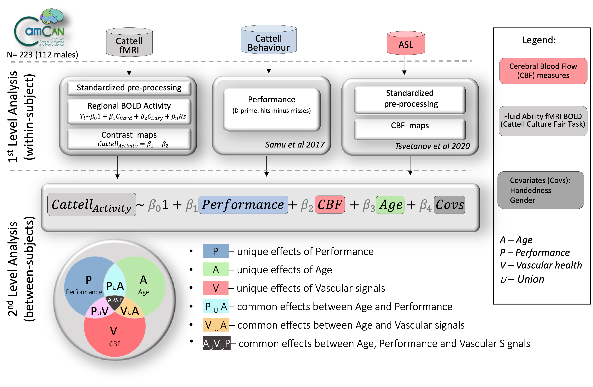

# Legacy Repository: Commonality Analysis for Neuroimaging Toolbox

This repository is now **archived** as a legacy reference. 

All development has moved to the **new toolbox**:

➡️ [Voxel-Based Analysis Toolbox](https://github.com/kamentsvetanov/vba-toolbox)

The new repository includes:
- All functionality from this repository
- Flexible voxel-wise GLM analysis
- Mixed-effects models
- Support for multi-modal brain images

## Background

Originally developed to support [Wu et al., *"Cerebral blood flow predicts multiple demand network activity and fluid intelligence across the lifespan"*](https://www.sciencedirect.com/science/article/pii/S0197458022002044), this toolbox provided voxel-wise commonality analysis using MATLAB. The new repository retains this functionality and expands it.

---

**Citation:**  
If referencing the methods in your paper, you may still cite this repository. Users are encouraged to follow the new repository for up-to-date code.
